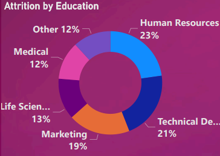
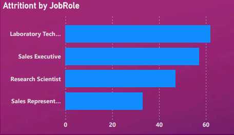
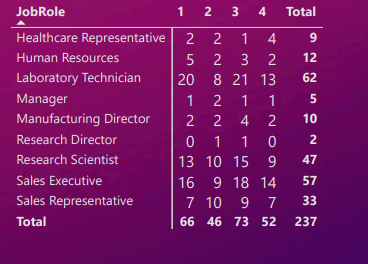
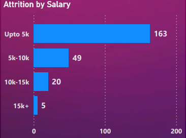
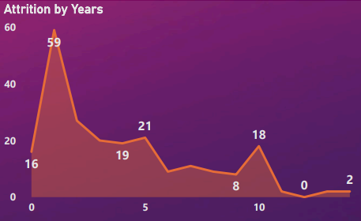
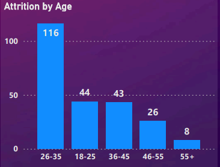

# Project Summary:

The project is a HR data analytics using Power BI tool to analyze employee attrition. The following metrics were analyzed:

- Count of Employees: to understand the total number of employees in the company.

- Attrition Count: to understand the number of employees who left the company.

- Attrition Rate: to understand the percentage of employees who left the company over a specific time period.

- Average Age: to understand the average age of employees in the company.

- Average Salary: to understand the average salary of employees in the company.

- Average Years in Company: to understand the average tenure of employees in the company.

# Data Source and Preparation:

The data for this analysis was sourced from [here](https://drive.google.com/drive/folders/18mQalCEyZypeV8TJeP3SME_R6qsCS2Og) and the data was cleaned and transformed to ensure accuracy and consistency.

# Attrition Analysis:

###### Chart 1: Attrition by Education (pie chart)

This chart provides a breakdown of the education level of employees who have left the company, which can help to identify any patterns or trends in the data. 

###### Chart 2: Attrition by Job Role (bar chart)

This chart displays the number of employees who left the company by job role. This can provide insight into which job roles are experiencing the highest levels of attrition, which can help identify any potential issues within those roles.

###### Chart 3: Attrition by Job Role and Job satisfaction (table)

TThis table shows the breakdown of employees who have left the company based on their job satisfaction and job role. This information can assist in identifying any differences in attrition rates across job roles and satisfaction levels, as well as any trends or patterns that may exist within particular job roles.

###### Chart 4: Attrition by Salary (bar chart)

This chart displays the number of employees who left the company by salary range. This can provide insight into whether employees in certain salary ranges are more likely to leave the company, which can help to identify potential issues with compensation and retention.

###### Chart 5: Attrition by Years (area chart)

This chart displays the number of employees who left the company by tenure, allowing for an understanding of when employees are most likely to leave the company.

###### Chart 6: Attrition by Age (bar chart)

This chart displays the number of employees who left the company by age range. This can provide insight into whether certain age groups are more likely to leave the company, which can help to identify potential issues with retention and career advancement.

# Conclusion:

Based on the analysis of the data, the following conclusions can be drawn:

###### 1. Summary:

1. Total Count of Employee: 1,470

2. Attrition Count: 237

3. Attrition Rate: 16.1%

4. Average Age: 37

5. Average Salary: $6.5K

6. Average Years: 7

7. Attrition By Gender: 
   
   1. Male - 143,
   
   2. Female - 80

###### 2. Findings:

    Findings from Attrition Analysis:

1. Attrition Rate by Education: The highest attrition rate is among employees with a Degree in Human Resources, followed by those with a Technical degree.

2. Attrition by Job Role: Laboratory Technicians have the highest attrition rate, followed by Sales Executives.

3. Attrition by Salary: The top two salary brackets for attrition are:
   
   1. Up to $5k
   
   2. \$5k to \$10k

4. Attrition by Years: The highest attrition occurs within the first year (0 to 1 year), followed by employees with 5 to 10 years of tenure.

5. Attrition by Age: The highest attrition rate is among employees aged 26 to 35 years, followed by those aged 18 to 25 years.

# Potential Solutions:

Based on these findings, the following strategies could be considered to improve employee retention:

- Review and potentially adjust compensation packages, particularly for employees earning up to $10k.

- Assess job roles with high attrition, such as Laboratory Technicians and Sales Executives, to identify potential work-related issues.

- Focus on retaining employees in their first year through onboarding and engagement initiatives.

- Evaluate employee satisfaction among younger employees (18 to 35 years old) and address potential concerns or challenges. 

# Reflections on Learning Experience:

Working on the HR\_Analytics\_Dashboard in Power BI has been an insightful journey. Throughout the process, I learned the importance of data visualization and analysis in understanding complex HR metrics, such as attrition.

The attrition analysis allowed me to identify key areas of concern, such as the high attrition rate among specific groups of employees. For instance, I discovered that employees with a Degree in Human Resources and those with a Technical degree had the highest attrition rate. Similarly, Laboratory Technicians and Sales Executives had a higher tendency to leave the company.

Moreover, the analysis showed that salary and tenure were significant factors affecting attrition. The employees in lower salary brackets and those with shorter tenures (0 to 1 year) or mid-range tenures (5 to 10 years) were more likely to leave. Age was another critical factor, with younger employees (18 to 35 years) having higher attrition rates.

Through this project, I learned how to transform raw data into meaningful insights, enabling decision-makers to formulate strategies that improve retention and create a better work environment. In conclusion, the experience has strengthened my understanding of Power BI and its capabilities in data analytics

###### Incorporating Dynamic Data Sources in Power BI:

During the project, I focused on optimizing the data source referencing within the dashboard. One of the solutions involved using parameters to refer to a relative file path of the data source. While this method provided flexibility in managing data sources, it required manual intervention to update the file path in the parameter.

To further enhance the automation of data source referencing, I implemented a Web URL for fetching data directly from online sources. This approach eliminated the need for manual intervention, as it automatically adapts to changes in the data source's location, ensuring seamless and up-to-date data retrieval.

In conclusion, the integration of dynamic data sources into the HR Analytics Dashboard improved its functionality and efficiency. The use of a Web URL, in particular, allowed for a more streamlined and automated data retrieval process, reducing the potential for errors and enhancing the overall performance of the dashboard.

# Usage:

To download the Power BI dashboard:

1. Begin by opening either Command Prompt, Terminal, or Git Bash, depending on your operating system. Once opened, use the appropriate commands to navigate to the desired directory on your local machine where you want to clone the GitHub repository.

2. Clone the repository using the below command

    git clone https://github.com/cloudforce01/HR_Data_Analytics"

3. Navigate to the directory where the repository was cloned using the cd command.

4. Open the HR_Data_Analytics.pbix file in Power BI to view the dashboard.
